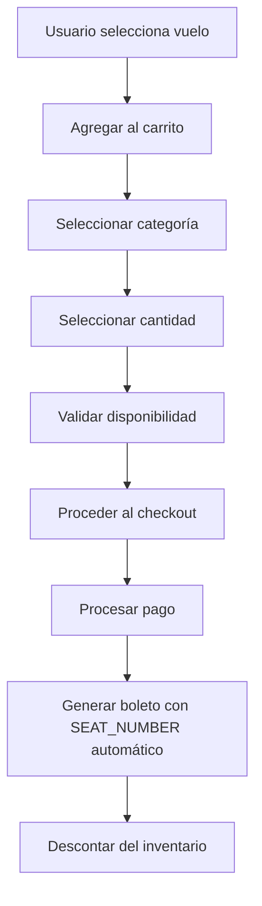

# 🪑 Sistema de Manejo de Asientos como Inventario

Este documento describe el nuevo sistema de manejo de asientos que implementa un modelo de inventario en lugar de selección individual de asientos.

## 🎯 **Cambio de Paradigma**

### **Sistema Anterior (Selección Individual)**
- ❌ Usuario selecciona asiento específico (A1, B3, etc.)
- ❌ Validación compleja de disponibilidad por asiento
- ❌ Posibilidad de conflictos entre usuarios
- ❌ Base de datos con campos SEAT_NUMBER obligatorios

### **Sistema Nuevo (Inventario por Categoría)**
- ✅ Usuario selecciona solo categoría (Económica, Ejecutiva, Primera Clase)
- ✅ Sistema maneja inventario automáticamente
- ✅ Sin conflictos de asientos
- ✅ Base de datos con SEAT_NUMBER generado automáticamente

## 🏗️ **Arquitectura del Sistema**

### **1. Modelo de Inventario**
```typescript
interface FlightInventory {
  ECONOMY: {
    availableSeats: number
    totalSeats: number
    reservedSeats: number
    soldSeats: number
  }
  BUSINESS: {
    availableSeats: number
    totalSeats: number
    reservedSeats: number
    soldSeats: number
  }
  FIRST_CLASS: {
    availableSeats: number
    totalSeats: number
    reservedSeats: number
    soldSeats: number
  }
}
```

### **2. Flujo de Reserva**


## 🔧 **Implementación Técnica**

### **Generación Automática de SEAT_NUMBER**
```typescript
// En checkout.vue - línea 470
seatNumber: `AUTO-${item.flight.flightNumber}-${item.selectedCategory}-${Date.now()}`
```

**Formato del SEAT_NUMBER:**
- `AUTO-` : Prefijo para identificar asientos automáticos
- `{flightNumber}` : Número del vuelo (ej: AV111)
- `{category}` : Categoría seleccionada (ECONOMY, BUSINESS, FIRST_CLASS)
- `{timestamp}` : Timestamp único para evitar duplicados

**Ejemplos:**
- `AUTO-AV111-ECONOMY-1692800000000`
- `AUTO-AV112-BUSINESS-1692800001000`
- `AUTO-AV113-FIRST_CLASS-1692800002000`

### **Ventajas del Sistema**
1. **Simplicidad**: Usuario solo elige categoría y cantidad
2. **Sin Conflictos**: No hay disputas por asientos específicos
3. **Escalabilidad**: Fácil de manejar grandes volúmenes
4. **Flexibilidad**: Permite cambios de asiento sin problemas
5. **Auditoría**: Cada boleto tiene identificador único

## 📊 **Gestión del Inventario**

### **Operaciones de Inventario**
```typescript
// Al crear un boleto
const updateInventory = async (flightId: number, category: string, quantity: number) => {
  // 1. Verificar disponibilidad
  const inventory = await getFlightInventory(flightId)
  const categoryInventory = inventory[category]
  
  if (categoryInventory.availableSeats < quantity) {
    throw new Error('No hay suficientes asientos disponibles')
  }
  
  // 2. Actualizar inventario
  categoryInventory.availableSeats -= quantity
  categoryInventory.soldSeats += quantity
  
  // 3. Guardar cambios
  await saveFlightInventory(flightId, inventory)
}
```

### **Estados del Inventario**
- **availableSeats**: Asientos disponibles para compra
- **reservedSeats**: Asientos reservados temporalmente
- **soldSeats**: Asientos vendidos
- **totalSeats**: Capacidad total de la categoría

## 🎨 **Interfaz de Usuario**

### **Selección en el Carrito**
```vue
<!-- Categoría -->
<select v-model="item.selectedCategory">
  <option value="">Seleccionar categoría</option>
  <option value="ECONOMY">Económica - $150</option>
  <option value="BUSINESS">Ejecutiva - $300</option>
  <option value="FIRST_CLASS">Primera Clase - $500</option>
</select>

<!-- Cantidad -->
<div class="quantity-selector">
  <button @click="decreaseQuantity(index)">-</button>
  <span>{{ item.quantity }}</span>
  <button @click="increaseQuantity(index)">+</button>
</div>
```

### **Validación en Tiempo Real**
- ✅ Verificación de disponibilidad al cambiar categoría
- ✅ Límite de cantidad basado en asientos disponibles
- ✅ Feedback visual del estado del inventario
- ✅ Prevención de reservas excesivas

## 🔒 **Validaciones y Seguridad**

### **Validaciones del Frontend**
```typescript
const canProceedToCheckout = computed(() => {
  return cartItems.value.length > 0 && 
         cartItems.value.every(item => 
           item.selectedCategory && 
           item.quantity > 0 &&
           item.quantity <= item.inventoryByCategory[item.selectedCategory]?.availableSeats
         )
})
```

### **Validaciones del Backend**
```java
// En TicketDAO.java
public boolean validateSeatAvailability(Long flightId, String category, int quantity) {
    FlightInventory inventory = getFlightInventory(flightId);
    CategoryInventory categoryInventory = inventory.getCategory(category);
    
    return categoryInventory != null && 
           categoryInventory.getAvailableSeats() >= quantity;
}
```

## 📱 **Experiencia del Usuario**

### **Flujo Simplificado**
1. **Explorar Vuelos** → Usuario ve opciones disponibles
2. **Agregar al Carrito** → Solo selecciona categoría
3. **Gestionar Cantidad** → Elige cuántos asientos necesita
4. **Checkout** → Proceso de pago simplificado
5. **Confirmación** → Boleto con asiento automático

### **Beneficios para el Usuario**
- 🚀 **Más Rápido**: No hay que elegir asientos específicos
- 🎯 **Más Simple**: Solo categoría y cantidad
- 💰 **Más Transparente**: Precios claros por categoría
- 🔄 **Más Flexible**: Fácil cambiar reservas

## 🔮 **Mejoras Futuras**

### **Funcionalidades Adicionales**
- [ ] **Asignación Inteligente**: Algoritmos para optimizar distribución
- [ ] **Preferencias**: Guardar preferencias del usuario (ventana, pasillo)
- [ ] **Upgrades**: Permitir cambios de categoría antes del vuelo
- [ ] **Grupos**: Manejo especial para reservas grupales

### **Optimizaciones Técnicas**
- [ ] **Cache de Inventario**: Reducir consultas a la base de datos
- [ ] **Transacciones Atómicas**: Garantizar consistencia del inventario
- [ ] **Notificaciones**: Alertas de disponibilidad en tiempo real
- [ ] **Analytics**: Reportes de ocupación y tendencias

## 🧪 **Casos de Prueba**

### **Escenarios de Validación**
1. ✅ **Reserva Normal**: Usuario reserva 2 asientos económicos
2. ✅ **Cambio de Categoría**: Usuario cambia de económica a ejecutiva
3. ✅ **Límite de Disponibilidad**: Usuario intenta reservar más asientos de los disponibles
4. ✅ **Múltiples Usuarios**: Varios usuarios reservan simultáneamente
5. ✅ **Cancelación**: Usuario cancela y se liberan asientos

### **Pruebas de Estrés**
- **Concurrencia**: Múltiples reservas simultáneas
- **Volumen**: Reservas masivas en vuelos populares
- **Recuperación**: Comportamiento después de fallos del sistema
- **Performance**: Tiempo de respuesta con inventario grande

## 📚 **Documentación Relacionada**

- [Sistema de Carrito](./CART_SYSTEM_README.md)
- [API de Vuelos](./API_DOCUMENTATION.md)
- [Componentes de UI](./COMPONENTS_README.md)
- [Base de Datos](./DATABASE_SCHEMA.md)

## 🤝 **Contribución**

Para contribuir a este sistema:

1. **Fork** del repositorio
2. **Crear rama** para tu feature
3. **Implementar cambios** con tests
4. **Crear Pull Request** con descripción detallada
5. **Incluir screenshots** de cambios visuales

## 📄 **Licencia**

Este código está bajo la misma licencia que el proyecto principal.
