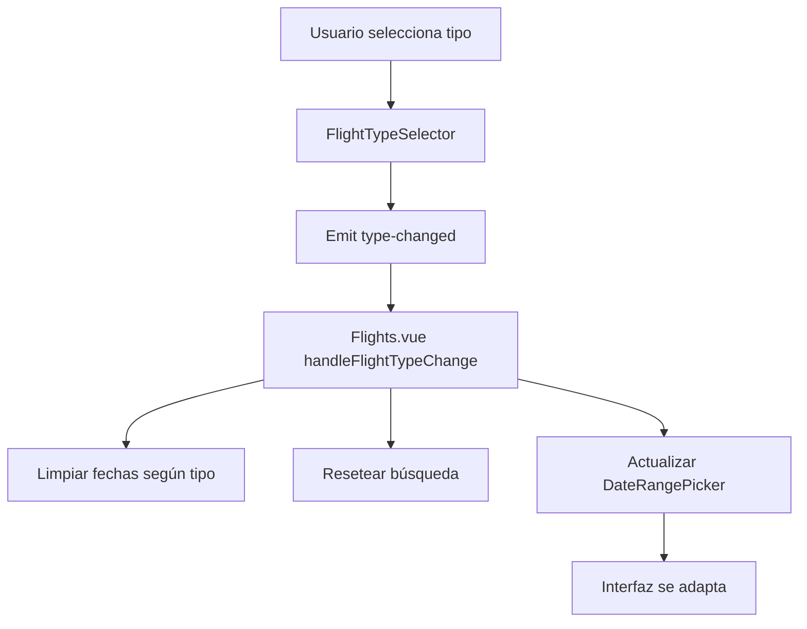

# ✈️ Implementación de Tipos de Vuelo

Este documento describe la implementación del sistema de tipos de vuelo que permite manejar vuelos de solo ida, solo regreso y vuelos redondos.

## 🎯 **Tipos de Vuelo Implementados**

### 1. **Vuelo Solo Ida (One-Way)**
- **Descripción**: Un viaje de ida sin regreso
- **Casos de uso**:
  - Viajes de negocios
  - Migración
  - Cuando el regreso se maneja por separado
- **Campos requeridos**:
  - ✅ Origen
  - ✅ Destino
  - ✅ Fecha de salida
  - ✅ Pasajeros
- **Campos opcionales**:
  - ❌ Fecha de regreso (se oculta)

### 2. **Vuelo Solo Regreso (Return-Only)**
- **Descripción**: Un viaje de regreso sin ida
- **Casos de uso**:
  - Viajeros que ya están en el destino
  - Vuelos de ida separados
  - Viajeros frecuentes
- **Campos requeridos**:
  - ✅ Origen
  - ✅ Destino
  - ✅ Fecha de regreso
  - ✅ Pasajeros
- **Campos opcionales**:
  - ❌ Fecha de salida (se oculta)

### 3. **Vuelo Redondo (Round-Trip)**
- **Descripción**: Viaje completo de ida y vuelta
- **Casos de uso**:
  - Turismo
  - Vacaciones familiares
  - Viajes de placer
- **Campos requeridos**:
  - ✅ Origen
  - ✅ Destino
  - ✅ Fecha de salida
  - ✅ Fecha de regreso
  - ✅ Pasajeros

## 🏗️ **Arquitectura de la Solución**

### **Componentes Principales**

#### 1. **FlightTypeSelector.vue**
```vue
<FlightTypeSelector 
  v-model="searchParams.flightType"
  @type-changed="handleFlightTypeChange"
/>
```

**Responsabilidades**:
- Mostrar opciones de tipo de vuelo
- Manejar selección del usuario
- Proporcionar información contextual
- Emitir eventos de cambio

#### 2. **DateRangePicker.vue** (Actualizado)
```vue
<DateRangePicker 
  :departure-date="searchParams.departureDate"
  :return-date="searchParams.returnDate"
  :flight-type="searchParams.flightType"
  @update:departure-date="searchParams.departureDate = $event"
  @update:return-date="searchParams.returnDate = $event"
/>
```

**Responsabilidades**:
- Adaptar interfaz según tipo de vuelo
- Validar fechas según el contexto
- Manejar selección secuencial para redondos
- Ocultar campos innecesarios

#### 3. **Flights.vue** (Página Principal)
**Responsabilidades**:
- Coordinar todos los componentes
- Manejar lógica de negocio
- Validar formularios
- Ejecutar búsquedas

### **Flujo de Datos**



## 🔧 **Implementación Técnica**

### **Estado del Componente**

```typescript
// Parámetros de búsqueda
const searchParams = ref({
  origin: '',
  destination: '',
  departureDate: '',
  returnDate: '',
  passengers: 1,
  flightType: 'round-trip' // 'one-way', 'return-only', 'round-trip'
})
```

### **Manejo de Cambios de Tipo**

```typescript
const handleFlightTypeChange = (type: string) => {
  console.log('✈️ Tipo de vuelo cambiado a:', type)
  
  // Limpiar fechas según el tipo seleccionado
  if (type === 'one-way') {
    searchParams.value.returnDate = ''
  } else if (type === 'return-only') {
    searchParams.value.departureDate = ''
  }
  
  // Resetear búsqueda
  searchPerformed.value = false
  error.value = ''
}
```

### **Adaptación del DateRangePicker**

```typescript
const selectDate = (day: any) => {
  if (day.disabled || day.otherMonth) return
  
  if (props.flightType === 'one-way') {
    // Solo ida: solo seleccionar fecha de salida
    departureDate.value = day.date
    emit('update:departureDate', day.date.toISOString().split('T')[0])
    closeCalendar()
  } else if (props.flightType === 'return-only') {
    // Solo regreso: solo seleccionar fecha de regreso
    returnDate.value = day.date
    emit('update:returnDate', day.date.toISOString().split('T')[0])
    closeCalendar()
  } else {
    // Vuelo redondo: selección secuencial
    // ... lógica existente
  }
}
```

## 🎨 **Interfaz de Usuario**

### **Selector de Tipo de Vuelo**
- **Diseño**: Tarjetas seleccionables con radio buttons
- **Iconos**: Emojis descriptivos para cada tipo
- **Información**: Descripción y características de cada opción
- **Estado**: Selección visual clara con colores y sombras

### **Adaptación de Campos de Fecha**
- **Solo Ida**: Solo muestra campo de fecha de salida
- **Solo Regreso**: Solo muestra campo de fecha de regreso
- **Redondo**: Muestra ambos campos con separador visual

### **Validaciones Visuales**
- **Colores**: Diferentes colores para cada tipo de vuelo
- **Iconos**: Iconos contextuales según el tipo
- **Mensajes**: Información contextual y tips útiles

## 📱 **Responsive Design**

### **Desktop (> 1024px)**
- Layout horizontal con todos los elementos visibles
- Espaciado generoso entre componentes
- Información completa visible

### **Tablet (768px - 1024px)**
- Ajustes de padding y márgenes
- Reorganización de elementos
- Mantiene funcionalidad completa

### **Mobile (< 768px)**
- Layout vertical para mejor usabilidad
- Campos apilados
- Botones de tamaño táctil
- Información condensada

## 🧪 **Casos de Prueba**

### **Funcionalidad Básica**
1. ✅ Selección de tipo de vuelo
2. ✅ Cambio entre tipos
3. ✅ Persistencia de selección
4. ✅ Limpieza de campos según tipo

### **Validaciones**
1. ✅ Solo ida: no requiere fecha de regreso
2. ✅ Solo regreso: no requiere fecha de salida
3. ✅ Redondo: requiere ambas fechas
4. ✅ Fechas de regreso posteriores a salida

### **Interfaz de Usuario**
1. ✅ Campos se ocultan/muestran correctamente
2. ✅ Iconos y colores son apropiados
3. ✅ Información contextual es útil
4. ✅ Responsive en diferentes dispositivos

## 🔮 **Mejoras Futuras**

### **Funcionalidades Adicionales**
- [ ] **Vuelos Multi-Ciudad**: Múltiples destinos
- [ ] **Vuelos Abiertos**: Sin fecha de regreso fija
- [ ] **Vuelos de Conexión**: Con escalas programadas
- [ ] **Vuelos de Temporada**: Precios especiales por temporada

### **Optimizaciones Técnicas**
- [ ] **Lazy Loading**: Cargar componentes según necesidad
- [ ] **State Management**: Pinia para estado global
- [ ] **Caching**: Cache de tipos de vuelo frecuentes
- [ ] **Analytics**: Tracking de selecciones de usuario

### **Integración con Backend**
- [ ] **API de Tipos**: Endpoint para tipos disponibles
- [ ] **Validaciones**: Reglas de negocio del servidor
- [ ] **Precios**: Cálculo de precios por tipo
- [ ] **Disponibilidad**: Verificación en tiempo real

## 📚 **Recursos y Referencias**

### **Documentación Técnica**
- [Vue 3 Composition API](https://vuejs.org/guide/extras/composition-api-faq.html)
- [TypeScript Interfaces](https://www.typescriptlang.org/docs/handbook/interfaces.html)
- [CSS Grid Layout](https://developer.mozilla.org/en-US/docs/Web/CSS/CSS_Grid_Layout)

### **Patrones de Diseño**
- [Component Communication](https://vuejs.org/guide/components/events.html)
- [State Management](https://vuejs.org/guide/scaling-up/state-management.html)
- [Form Validation](https://vuejs.org/guide/best-practices/forms.html)

### **Accesibilidad**
- [ARIA Labels](https://developer.mozilla.org/en-US/docs/Web/Accessibility/ARIA)
- [Keyboard Navigation](https://www.w3.org/WAI/WCAG21/quickref/#keyboard)
- [Screen Reader Support](https://www.w3.org/WAI/WCAG21/quickref/#text-alternatives)

## 🤝 **Contribución**

Para contribuir a esta implementación:

1. **Fork** del repositorio
2. **Crear rama** para tu feature
3. **Implementar cambios** con tests
4. **Crear Pull Request** con descripción detallada
5. **Incluir screenshots** de cambios visuales

## 📄 **Licencia**

Este código está bajo la misma licencia que el proyecto principal.
